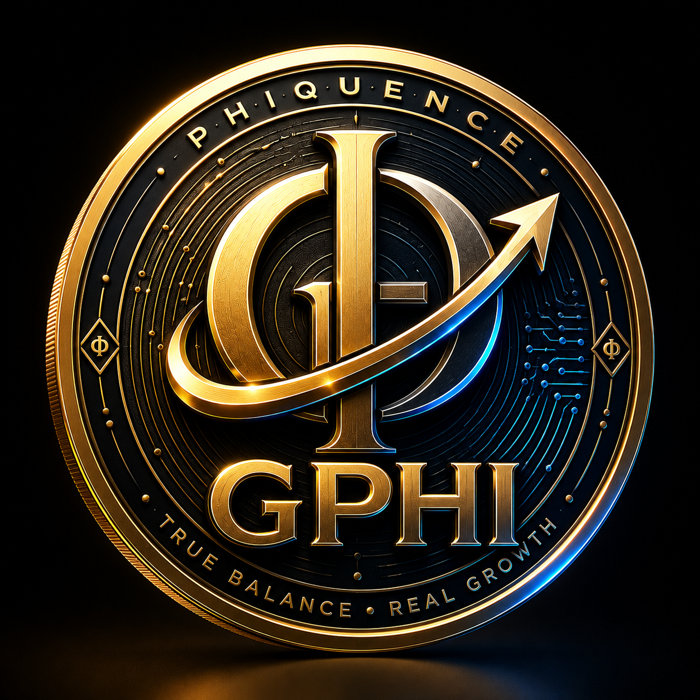

# phiquence-gphi-contract
Official smart contract repository for PHIQUENCE (GPHI) - A structurally governed BEP-20 ecosystem.

  
  <h1>PHIQUENCE (GPHI) Smart Contract</h1>
  
<b>True Balance. Real Growth.</b>

   
  
  
  

## 📌 Ecosystem Overview
PHIQUENCE is a structurally governed digital financial ecosystem built on mathematical balance and absolute transparency. The **GPHI** token is the core utility asset that powers our dynamic staking nodes, automated micro-incentive protocols, and the broader wealth architecture.

We focus on system-based yield optimization, eliminating the risks of artificial hype and unbacked guarantees.

## 🪙 Tokenomics & Golden Ratio Supply
The maximum supply of GPHI is mathematically fixed based on the Golden Ratio (Fibonacci sequence), ensuring long-term macroeconomic stability.

* **Token Name:** PHIQUENCE
* **Symbol:** GPHI
* **Decimals:** 18
* **Total Supply:** 2,618,000,000 GPHI
* **Minting:** `false` (No additional tokens can ever be created by any central authority)

## 🔐 Security & Contract Verification
The GPHI smart contract has been deployed with absolute transparency. It contains no backdoors, no mint functions, and no owner privileges that could jeopardize user funds.

* **Contract Address:** [`0x4e55e26409ca642d0d3c2346379e9de4926094aa`](https://bscscan.com/token/0x4e55e26409ca642d0d3c2346379e9de4926094aa)
* **Compiler Version:** Solidity v0.8.20
* **Optimization:** Enabled (200 Runs)
* **BscScan Status:** 100% Verified Code (0 Risky Items)

## 🌐 Official Infrastructure
* **Ecosystem Terminal:** [www.phiquence.com](https://www.phiquence.com)
* **Smart Contract Explorer:** [View on BscScan](https://bscscan.com/token/0x4e55e26409ca642d0d3c2346379e9de4926094aa)

## 📬 Global Community
Connect with the **PHIQUENCE Team** and global node operators:
* **X (Twitter):** [@phiquence](https://x.com/phiquence)
* **Discord:** [Join the Terminal](https://discord.gg/gecnwbwe8)
* **YouTube:** [PHIQUENCE Official](https://youtube.com/@phiquence?si=o6UqQ5RlZKmleDzg)

> **⚠️ Ecosystem Disclaimer:** PHIQUENCE is a utility-based digital infrastructure. GPHI does not represent equity, shares, or a guaranteed financial return. All network growth and rewards are entirely system-based, mathematically calculated, and dependent on active participation. True Balance. Real Growth.
